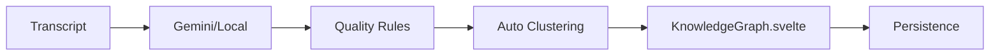

# Master Connection Map

## Architectural Summary
Cognivox follows a clear separation of concerns between its reactive frontend (Svelte) and its high-performance backend (Rust). Communications are handled via the Tauri IPC bridge.

## Core Data Flow
1. **Audio Input**: `audio_capture.rs` captures raw audio.
2. **Detection**: `vadManager.ts` (Frontend) and the backend processing loop identify speech.
3. **Transcription**: `whisper_client.rs` converts audio to text.
4. **Identification**: `speaker_id.rs` attributes speech to specific individuals.
5. **Intelligence**: `gemini_client.rs` sends transcripts to the Gemini API for tone, summary, and graph extraction.
7. **Persistence**: `session_manager.rs` (Local) and `firestoreSessionManager.ts` (Cloud) save the session data.

## Knowledge Graph Logic Flow

## Key Interface Points (Tauri Commands)
- `start_audio_capture` / `stop_audio_capture`
- `save_session` / `load_session` / `list_sessions`
- `initialize_speaker_id` / `identify_speaker`
- `initialize_whisper` / `transcribe_audio`
- `test_gemini_connection` / `update_gemini_key`

## UI Unification
- **Visual Scale**: Refer to `UI_UNIFICATION_v1/00_UI_INSPIRATION_ANALYSIS.md`.
- **Status**: 29 active Svelte/Tailwind UI elements unified under MAPPER_v1 protocol.

> [!NOTE] FINAL_COGNIVOX_BRANDING_POLISH_v1 STAMP
> **Date**: 2026-03-20 04:10
> **Status**: COGNIVOX_BRANDING_COMPLETE
> All "Meeting Mind" branding replaced with official COGNIVOX (blue square logo + bold text).
> Header unified: COGNIVOX logo + name centered in MainHeader on desktop.

> [!NOTE] GLOBAL_UI_SCALER_v1 STAMP
> **Target Scale**: 0.67
> **Date**: 2026-03-20
> **Status**: SCALED_TO_67_PERCENT (Replaced by UPSCALE_v1)

> [!IMPORTANT] GLOBAL_UI_SCALER_UP_v1 STAMP
> **Target Scale**: 1.25 (125% of ORIGINAL baseline)
> **Date**: 2026-03-22
> **Status**: UPSCALE_COMPLETE — 125_PERCENT_SCALED
