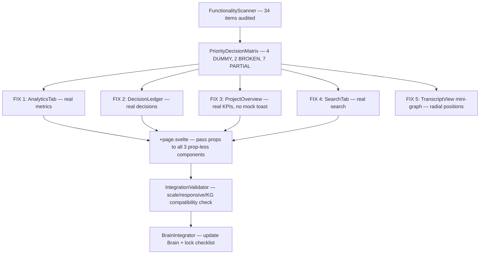

# Centralized Contextual Fix Plan

## Logical Execution Chain

## Step-by-Step Execution

### Phase 1: Scanner (complete)
- Read all 32 source files + 5 previous audit reports
- Produced `SUBAGENTS/FunctionalityScanner.md` with 34 items, statuses, and root causes

### Phase 2: Priority Matrix (complete)
- Ranked 4 DUMMY (CRITICAL), 2 BROKEN (HIGH), 7 PARTIAL (MEDIUM/LOW)
- Produced `01_DECISION_MATRIX_PRIORITY_ORDERED.md`

### Phase 3: Code Fixes (complete)

| Fix | File | Change |
|-----|------|--------|
| AnalyticsTab | `src/lib/AnalyticsTab.svelte` | Replaced hardcoded `speakers`/`emotions`/KPI constants with `$:` reactive derivations from `transcripts` prop. Speaker dominance = utterance count per speaker. Emotion pulse = tone bucket aggregation. Sentiment % = positive/total ratio. Dominance index = max speaker share. Tone SVG path = sampled from last 20 transcripts. |
| DecisionLedger | `src/lib/DecisionLedger.svelte` | Added `transcripts: any[]` prop. Derived `decisions` by filtering `t.category.includes('DECISION')`. Added `filterQuery` binding for real search. Empty state shown when no decisions exist. Removed `{@html}` for title/rationale (XSS safety). |
| ProjectOverview | `src/lib/ProjectOverview.svelte` | Added `transcripts`, `graphNodes`, `pastSessions` props. `showToast = false` (mock toast removed). Real KPIs: `totalRisks` from RISK-type nodes, `highSeverityRisks` from weight≥0.7, `sessionCount` from pastSessions, `healthScore` from risk ratio. Timeline from real session dates. Risks/tracker from real graph nodes. |
| SearchTab | `src/lib/SearchTab.svelte` | Added `transcripts`, `graphNodes`, `initialQuery` props. Full-text search against all transcripts (meetings), decisions/tasks (category-filtered), graph nodes (documents). Filter chips wired to `activeFilter` state. Highlight function wraps matches in ``. Paginated with `visibleCount`. Empty state shown. |
| TranscriptView | `src/lib/TranscriptView.svelte` | Added `nodePositions: Map<string, {x,y}>` derived from radial layout (800×560 viewBox). Start node at center, others in concentric rings of 8. SVG gets `viewBox="0 0 800 560"`. All `node.x || 0` replaced with `nodePositions.get(id)`. |
| +page.svelte | `src/routes/+page.svelte` | DecisionLedger now receives `{transcripts}`. ProjectOverview now receives `{transcripts}`, `{graphNodes}`, `{pastSessions}`. SearchTab now receives `{transcripts}`, `{graphNodes}`, `initialQuery={searchQuery}`. |

### Phase 4: Items Confirmed Already Working (re-audit corrected FunctionalityScanner)
- **InsightsPanel**: `intelligenceExtractor.extractFromTranscript()` IS called in `gemini_intelligence` handler AND in `runProcessingFlow` Step 5. Was mistakenly listed as "never triggered".
- **Split-brain KG**: `!isRecording` guard IS present in `runProcessingFlow` Step 4 (FIX 2 comment). Additive-only logic IS applied in `gemini_intelligence` handler.
- **Timestamp sync**: `createTranscriptEntry(seg, payload.utterance_start_ms)` IS called with second arg.

### Phase 5: Remaining Gaps (not fixable without backend changes or external tooling)
- **Chunk ID in Rust**: Frontend handles `chunk_id` if sent. Rust `whisper_client.rs` / `gemini_client.rs` may not emit it yet. Would require modifying Rust structs and event emission.
- **ONNX model file**: Must be generated via `python scripts/export_ecapa_tdnn.py`. Cannot be bundled automatically.
- **Firebase env vars**: Configuration concern, not a code issue.
