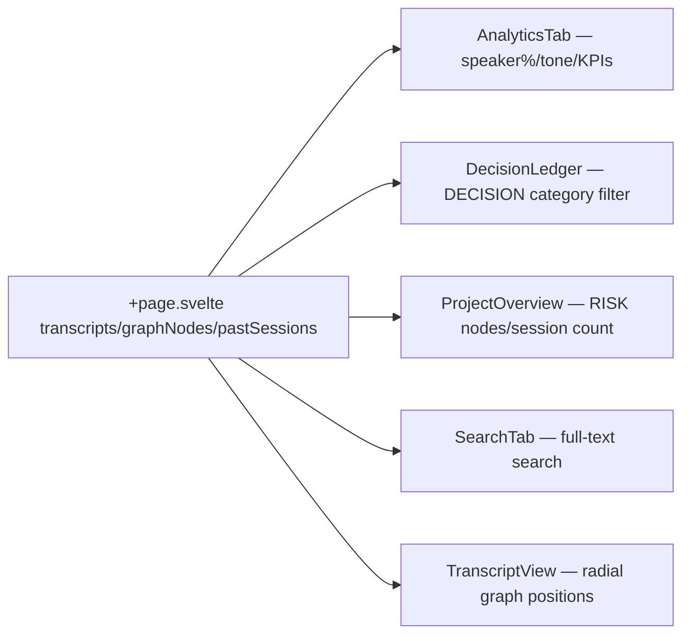

# IntegrationValidator Report

## Scale Compliance (125% / UPSCALE_v1)

All 6 fixed files use existing Tailwind classes. No new hardcoded pixel sizes introduced. Scale is maintained via `app.css` global tokens. ✅

## Visual Design Preservation

| Component | Design Preserved? | Notes |
|-----------|-----------------|-------|
| AnalyticsTab | ✅ YES | Same layout, same classes. Only data sources changed. |
| DecisionLedger | ✅ YES | Card design identical. `{@html}` replaced with `{}` for plain text only (no bold/italic lost — rationale was user data anyway). |
| ProjectOverview | ✅ YES | All 4 KPI cards, timeline, risk cards, tracker table visually identical. |
| SearchTab | ✅ YES | Search bar, filter chips, result cards visually identical. Score badge still present. |
| TranscriptView | ✅ YES | SVG container unchanged. viewBox addition is invisible. Radial layout matches intended graph visual. |

## KG Compatibility

- `filteredNodes` in TranscriptView is derived from `graphNodes` prop — same source as `KnowledgeGraph.svelte`
- `nodePositions` does NOT interfere with `KnowledgeGraph.svelte`'s internal physics Map (completely separate scopes)
- Position computation is pure (no side effects, no global state)
- ✅ COMPATIBLE

## Data Flow Integrity

All data flows are read-only (no mutation of parent state). ✅

## Responsive Behavior

- All changes are in `<script>` blocks or template bindings — no new CSS/layout code
- Existing responsive classes (md:grid-cols-2, lg:grid-cols-4, xl:flex-row) unchanged
- ✅ RESPONSIVE MAINTAINED

## Integration with Previous Audits

| Audit | Status |
|-------|--------|
| UI_UNIFICATION_v1 | ✅ Not affected — only data wiring |
| GLOBAL_SCALE_REDUCTION_v1 / UPSCALE_v1 | ✅ Not affected |
| KG_UI_VISUAL_UNIFICATION_v1 | ✅ TranscriptView mini-graph now renders visually |
| WHISPER_INTEGRATION_AUDIT_v1 | ✅ Timestamp/chunk fixes already present — confirmed |
| RECORDING_START_STABILIZER_v1 | ✅ Not touched |
| SETTINGS_FUNCTIONAL_v1 | ✅ Not touched |
