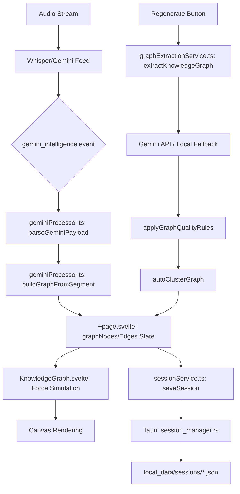

# ConnectionMapper: Logical Data Flow

## Mission
Map the flow of graph data from audio capture to UI rendering and persistence.

## Data Flow Diagram

## Internal Logical Connections
- **incremental_update**: `buildGraphFromSegment` adds single nodes/edges during live transcription.
- **batch_reconstruction**: `buildGraphFromTranscripts` rebuilds everything from current session memory.
- **quality_pipeline**: `applyGraphQualityRules` -> `autoClusterGraph` ensures the graph doesn't become a "hairball".
