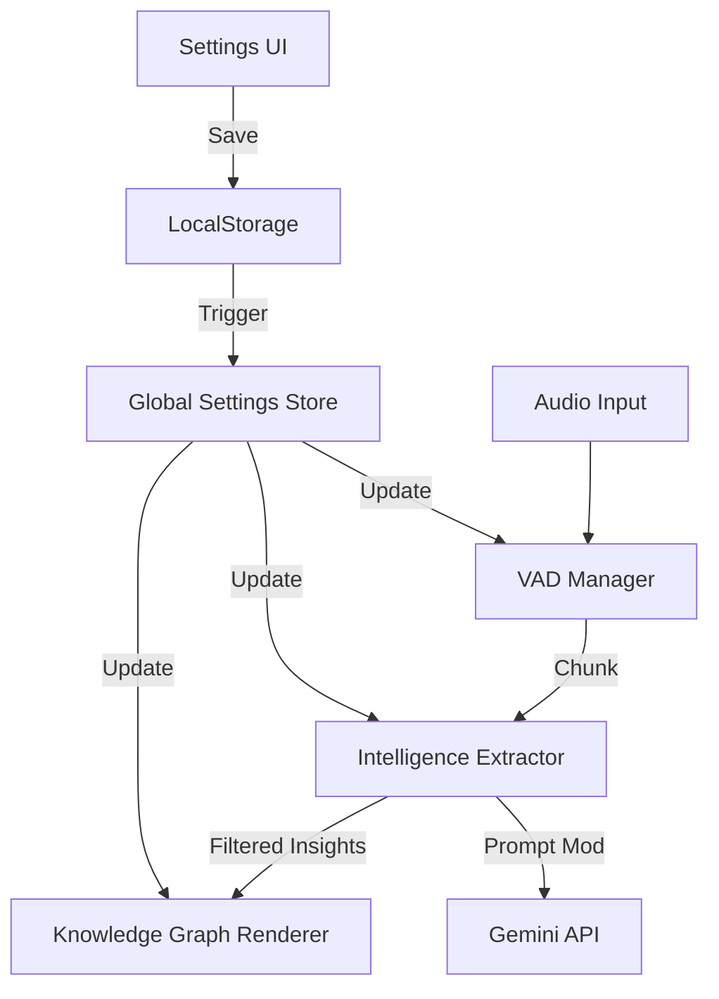

# 01_CONTROL_TO_PIPELINE_MAPPING

This document maps every UI control in the Settings Panel to its functional counterpart in the processing pipeline.

## Settings Mapping Table

| UI Control | Component Variable | Engine Target | Real-Time Impact |
| --- | --- | --- | --- |
| **Transcription Model** | `selectedModel` | `intelligenceExtractor.extractFromTranscript` URL | Swaps Gemini API model for the next extraction request. |
| **Confidence Threshold** | `confidenceThreshold` | `intelligenceExtractor.ts` (new) | Will filter out insights/nodes where Gemini's confidence score < threshold. |
| **Voice Activity Sensitivity** | `vadSensitivity` | `vadManager.config.silenceThreshold` | Adjusts how loud speech must be (RMS) to be considered "speaking". |
| **Auto-connect on startup** | `autoConnect` | `+page.svelte` (onMount logic) | Triggers automatic Gemini initialization when the app starts. |
| **Intelligence Filters** | `filters` (object) | `intelligenceExtractor.filters` | **TASKS/DECISIONS/etc.**: Controls which JSON keys are requested from Gemini AND which nodes are rendered in KG. |
| **Min Speech Buffer** | `vadMinSpeech` | `vadManager.config.minSpeechDuration` | Minimum ms of continuous speech required to start a chunk. |
| **Silence Detection** | `vadSilenceTime` | `vadManager.config.silenceDuration` | Ms of silence required to consider an utterance finished and send to Gemini. |
| **Min Chunk Size** | `vadMinChunk` | `vadManager.config.minChunkDuration` | Minimum ms for a valid audio chunk; shorter bursts are discarded to save costs. |
| **Filler Detection** | `enableFillerDetection` | `vadManager.stripFillerWords` | If true, regex-strips "um, uh, like" from transcription before showing in UI. |
| **Enable Debug Mode** | `enableDebugMode` | `StatusBar`, `DebugBar`, `Console` | Toggles visibility of the DebugBar and detailed logging. |

## Pipeline Logic Flow (Mermaid)

## Functional Gap Analysis
- **KG Reactivity**: Changing filters must hide *existing* nodes in the `TranscriptView.svelte` without re-running Gemini.
- **VAD Hot-Reload**: `setConfig` in `vadManager` is called, but the active audio stream processing loop in `+page.svelte` needs to be notified or check config per-frame.
