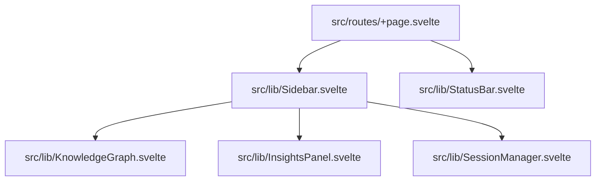

# SUB-AGENT: SidebarFileLocator

## File Location Mapping

| Section | Role | Full Path | Current Problems |
| :--- | :--- | :--- | :--- |
| [SIDEBAR_CORE] | Container | `src/lib/Sidebar.svelte` | Mixed layout logic, non-responsive widths, fixed heights. |
| [MISSIONS_PANEL] | List & Actions | `src/lib/Sidebar.svelte` | Inside Core, ugly placeholder, inconsistent padding. |
| [KG_PLACEHOLDER] | Graph View | `src/lib/KnowledgeGraph.svelte` | Placeholder is a static-looking Div, poor contrast, non-interactive. |
| [STATUS_BAR] | Global Status | `src/lib/StatusBar.svelte` | "No API key" notice at very bottom, overlaps with sidebar footer. |
| [SIDEBAR_FOOTER] | Auth & Sync | `src/lib/SessionManager.svelte` | Messy error stacking, ugly Google button, no visual hierarchy. |
| [BRANDING] | Header | `src/lib/Sidebar.svelte` | Simple H1/P, lack of professional visual rhythm. |
| [CONTENT_FLOW] | App Shell | `src/routes/+page.svelte` | `lg:w-72` fixed width, poor mobile collapse implementation. |

## File Tree (Sidebar Context)

## Problem Manifest
- **Fixed Widths**: `w-72` (Line 40 in `Sidebar.svelte`) doesn't flex well on small desktops.
- **Fixed Heights**: `h-60 sm:h-72 lg:h-[30vh]` (Line 52 in `Sidebar.svelte`) causes overflow issues or wasted space.
- **Inconsistent Padding**: `p-5` vs `p-4` vs `p-[something else]`.
- **Status Clutter**: Logic for Firebase/Cloud Offline is buried in `SessionManager.svelte`.
- **Typography**: Uses hardcoded `text-xl`, `text-xs`, `text-[10px]` instead of fluid `clamp()` tokens.
