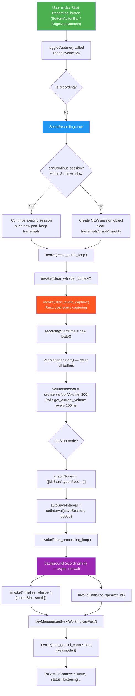
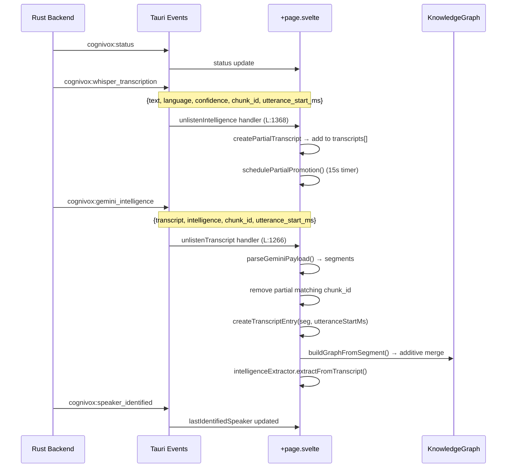

# START RECORDING — Complete Click Flow Map

## Mermaid: UI → Backend Data Flow

## Step-by-Step Code Trace

| Step | File | Line | Action | UI Effect |
|------|------|-------|--------|-----------|
| 1 | BottomActionBar.svelte | - | User clicks Start | Button activates |
| 2 | +page.svelte | 726 | `toggleCapture()` called | - |
| 3 | +page.svelte | 778 | `isRecording = true` | LIVE badge appears |
| 4 | +page.svelte | 782-841 | Session continuation check | - |
| 5 | +page.svelte | 843 | `invoke("reset_audio_loop")` | - |
| 6 | +page.svelte | 848 | `invoke("clear_whisper_context")` | - |
| 7 | +page.svelte | 856 | `invoke("start_audio_capture")` | Mic starts |
| 8 | +page.svelte | 858 | `recordingStartTime = new Date()` | Timer starts |
| 9 | +page.svelte | 860 | `vadManager.start()` | VAD waveform activates |
| 10 | +page.svelte | 861 | `volumeInterval = setInterval(pollVolume, 100)` | Volume bar updates |
| 11 | +page.svelte | 862-872 | Graph Start node seeded | KG shows "Start" node |
| 12 | +page.svelte | 873 | `autoSaveInterval = setInterval(saveSession, 30000)` | Auto-save every 30s |
| 13 | +page.svelte | 875 | `invoke("start_processing_loop")` | Backend loop starts |
| 14 | +page.svelte | 883-897 | `backgroundRecordingInit()` — async | Status: "Initializing AI..." |
| 15 | connectionService.ts | 209-223 | Whisper+ECAPA init in parallel | Status: "Whisper ready" |
| 16 | connectionService.ts | 239 | `keyManager.getNextWorkingKeyFast()` | - |
| 17 | connectionService.ts | 255 | `invoke("test_gemini_connection")` | Status: "Connected" |

## Audio Event Flow (After Start)

## UI State Changes on Recording Start

| State Variable | Before | After | UI Element Affected |
|---|---|---|---|
| `isRecording` | false | true | LIVE badge, Stop button visible |
| `recordingStartTime` | null | Date() | Recording timer |
| `vadState.status` | 'idle' | 'buffering' | VAD waveform |
| `currentVolume` | 0 | live value | Volume bar |
| `graphNodes` | [] | [{id:'Start'}] | KG canvas |
| `status` | "Ready" | "Listening..." | Status bar text |
| `isGeminiConnected` | varies | true | AI indicator |
