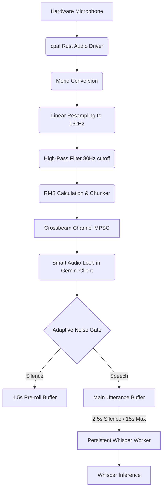

# Audio Input to Transcription Pipeline Map

This document exhaustively details the pipeline from hardware microphone access all the way to the Whisper model inference call.

## Pipeline Flow

## 1. Hardware & Audio Capture
- **Source**: `src-tauri/src/audio_capture.rs`
- **Library**: `cpal` for cross-platform low-latency capture.
- **Format Conversion**: 
  - Device input channels are summed and averaged to Mono.
  - Linear Interpolation resampling to `16000 Hz` (Whisper native sample rate).
  - High-pass single-pole IIR filter applied (~80Hz cutoff) to eliminate low-frequency AC hum and system fans.
- **Chunking**: Samples are pushed in 10ms micro-chunks (160 samples at 16kHz), tagged with AudioSource (Microphone vs System).

## 2. Smart VAD and Utterance Batching
- **Source**: `src-tauri/src/gemini_client.rs` (specifically `smart_audio_loop`)
- **Adaptive Noise Floor**: 
  - Continuously adapts to background noise during silence.
  - Speech requires a 3.5x SNR above the noise floor (minimum threshold `0.003`, cap `0.15`).
- **Pre-roll Buffer**: 
  - Retains the last 1.5 seconds of "silence".
  - When speech triggers, prepends the pre-roll to the main buffer instantly so soft syllable attacks aren't lost safely.
- **Batching Thresholds**:
  - `MIN_SPEECH_SECS`: 1.5s
  - `SILENCE_TIMEOUT_SECS`: 2.5s
  - `MAX_BATCH_SECS`: 15s (safety valve to prevent massive GGML allocations).

## 3. Whisper Model Initialization
- **Source**: `src-tauri/src/whisper_client.rs`
- **Model Loading**: Defaults to `ggml-small.bin` directly downloaded via `hf_hub`.
- **Memory Strategy**: 
  - To prevent OOM crashes found in default whisper.cpp bindings, Initialization spawns a **Persistent Worker Thread**. 
  - Creates the massive `WhisperState` once (~236MB pre-allocation) and re-uses it indefinitely.

## 4. Inference Call
- **Invocation**: The `smart_audio_loop` fires `transcribe_audio_via_worker`, sending the utterance buffer over `crossbeam_channel`.
- **Parameters**: 
  - Sampling Strategy: Greedy with `best_of = 2`.
  - Language: "auto" by default, Code-switching capable (English + Roman Urdu explicitly requested via `initial_prompt`).
  - Tuned flags: `entropy_thold: 2.0`, `logprob_thold: -0.5`.
