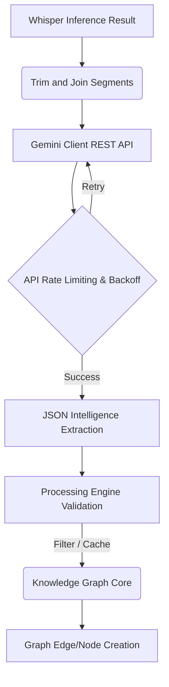

# Transcription to Node Creation Map

This document verifies the output of the transcription engine and exhaustively traces how the raw text becomes fully realized Knowledge Graph Nodes and Edges.

## Pipeline Flow

## 1. Transcription Output Handling
- **Source**: `src-tauri/src/whisper_client.rs`
- Whisper iterates through returned segments. 
- The text is trimmed of extra whitespace and concatenated into a single string.
- Hardware timestamps are not extracted from the Whisper model directly; real-time bounds are implicitly determined by the audio capturing timestamps.
- Confidence is hardcoded to `0.85` dynamically on completion.

## 2. The Intelligence Hand-off (Gemini)
- **Source**: `src-tauri/src/gemini_client.rs` (`process_transcript_with_gemini`)
- **JSON Prompting**: The transcription is enveloped in a massive System Prompt (`COGNIVOX_INTELLIGENCE_PROMPT`) explicitly instructing Gemini 2.0 Flash to return an array of JSON objects.
- **Entity Extraction Logic**: 
  - Prompt forces extraction of concepts, theories, methods, techniques, people, etc.
  - Enforces `graph_edges` containing `from`, `to`, and `relation`.
- **Rate Limiting & Error Handling**:
  - Implements a 1.0s minimum interval locking system.
  - Implements exponential backoff (starting at 3s and capping at 60s) specifically inspecting for HTTP 429 and 403 `RESOURCE_EXHAUSTED` flags.

## 3. Node Validation & Processing Engine
- **Source**: `src-tauri/src/processing_engine.rs` 
- Validates the resulting JSON string via `validate_intelligence_output` matching schemas for `IntelligenceOutput`, `Intelligence`, `Entity`, and `GraphUpdate`.
- Checks values against `VALID_CATEGORIES` and `VALID_TONES`.
- Blocks intelligence injection if `confidence < confidence_threshold` (default 0.5).

## 4. Graph Insertion Local DB
- **Source**: `KnowledgeGraph` struct within `src-tauri/src/processing_engine.rs`
- `add_edge()` function validates that `node_a` and `node_b` both exist as actual Entities.
- Instantiates `GraphNode` records.
- Instantiates `GraphEdge` records connecting them semantically with the relation provided by Gemini.
- Updates are retained locally in memory `Arc<Mutex<>>` waiting for polling or frontend listeners to render.
