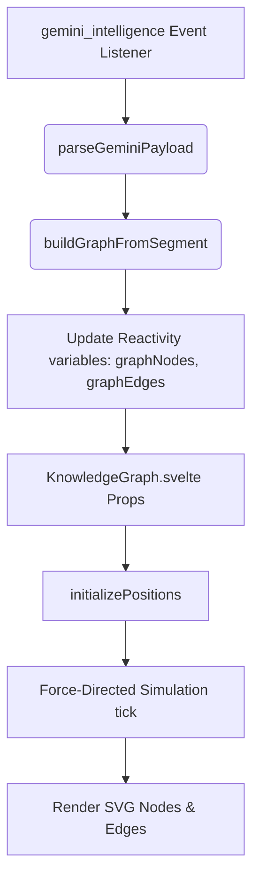

# Node to UI Display Map

This document exhaustively details how Knowledge Graph nodes generated from the transcription pipeline are injected into the visual UI.

## Pipeline Flow

## 1. Payload Parsing (`src/lib/services/geminiProcessor.ts`)
- On receiving payload from Rust, `parseGeminiPayload()` handles either an Array or Single Object format gracefully to prevent UI crashes if Gemini hallucinates the JSON structure.
- `createTranscriptEntry()` is called for the chat interface.
- `buildGraphFromSegment()` takes the incoming payload.

## 2. Graph Update Logic
- **Base Extraction**: 
  - The System guarantees a `Root / Start` node.
  - Generates a node for the assigned `Speaker`.
  - Generates nodes for `Category` and `Tone`.
- **Entity Injection**:
  - Checks the Gemini `entities` array.
  - If rate-limited / missing, relies on `extractQuickConcepts()` which uses Regex regex pattern matching (e.g. `called X`, `is a X`) to fallback.
- **Edges**: 
  - Reads `graph_edges` arrays from payload.
  - Links `Speaker` --discussed--> `Entity` dynamically.

## 3. KnowledgeGraph SVG Injection (`src/lib/KnowledgeGraph.svelte`)
- The `graphNodes` and `graphEdges` arrays are passed directly down as Svelte `export let` props.
- **Positioning**: `initializePositions()` attempts to spawn new incoming live nodes close to their connected source edges to prevent jarring visual layout jumps.
- **Simulation**: Uses a custom D3-like physics engine running loop inside `animate()` via `requestAnimationFrame`.
  - Constants: `REPULSION = 25000`, `ATTRACTION = 0.008`.
  - Settles dynamically over 600 ticks.
- **Color Mapping**: The `getNodeColor()` function maps exact string types (e.g., `CONCEPT`, `THEORY`, `Speaker`) to exact Tailwind hex equivalents.
