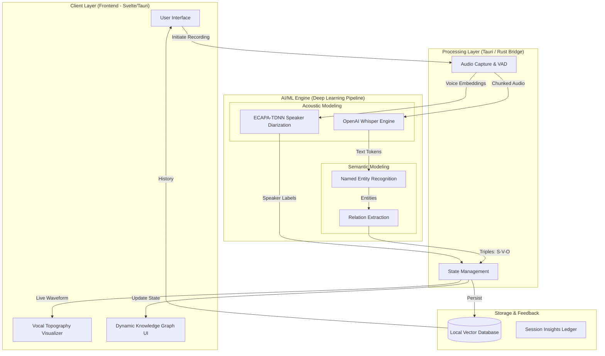

# Namal University, Mianwali
## Department of Computer Science

**Course Code:** CSC-361 Machine Learning  
**Semester:** Spring 2025  
**Instructor:** Dr. Shafiq Ur Rehman Khan  
**Track:** B – Software-Based AI System  
**Milestone:** 1 – Product Planning and System Design  

---

**Project Title:** Cognivox: Real-Time Intelligent Voice Analytics and Knowledge Synthesis  
**Group Name/No.:** [Insert Group Name/Number]  
**Submission Date:** March 30, 2026  

---

### 1. Problem Definition and Target Audience

#### 1.1 Problem Statement
In modern professional and academic environments, the volume of spoken information—delivered through meetings, lectures, and seminars—is overwhelming. Traditional note-taking is often fragmented, leading to "knowledge silos" where critical insights are lost because they are not indexed or connected to existing data. Existing transcription services provide "flat" text files that lack semantic structure, making it difficult to visualize relationships between discussed concepts or track speaker-specific contributions in real-time.

**Cognivox** addresses this gap by providing an end-to-end software-based AI system that not only transcribes audio in real-time but also employs deep learning to extract entities and relations, constructing a dynamic **Knowledge Graph (KG)**. The system transforms transient speech into a persistent, searchable, and interconnected intelligence base.

#### 1.2 Identified User Needs
*   **Real-Time Processing:** Users need immediate feedback and visualization during a live session rather than waiting for post-processed batches.
*   **Semantic Interconnectivity:** Users require a way to see how a topic mentioned at the start of a talk relates to a conclusion at the end.
*   **Speaker Accountability:** Identifying *who* said *what* is crucial for meeting minutes and academic discourse analysis.
*   **Cross-Platform Accessibility:** A lightweight, high-performance desktop interface for seamless integration into workflows.

#### 1.3 Target Audience
1.  **Academic Researchers:** For capturing and mapping complex technical discussions during lab meetings or conferences.
2.  **Corporate Professionals:** For automated, structured documentation of project requirements and stakeholder decisions.
3.  **Journalists and Interviewers:** For rapid extraction of quotes and thematic mapping of long-form interviews.
4.  **Students:** For generating structured study maps from recorded lectures.

---

### 2. System Architecture Diagram

The architecture of Cognivox is designed to handle high-throughput audio streams with low latency, utilizing a decoupled frontend-backend structure.

**Description:**  
The system follows a tiered approach. The **Client Layer** (Svelte/Tauri) handles high-frequency UI updates and WebGL-based visualizations. The **Processing Layer** serves as a bridge, managing Voice Activity Detection (VAD) to ensure the AI engine only processes relevant audio. The **AI/ML Engine** is the core, where deep learning models perform transcription and speaker identification in parallel. Finally, the **Semantic Modeling** block converts text into structured Knowledge Graph nodes (Subject-Verb-Object triples) which are then fed back to the UI for real-time visualization and persisted in a vector database for long-term retrieval.

---

### 3. Identification of ML Paradigm

Cognivox strictly adheres to the **Deep Learning (DL)** paradigm, a specialized subset of **Supervised Learning**.

#### 3.1 Justification and Fundamental Concepts (CLO-1)
To handle the complexities of human speech and natural language, classical Machine Learning (ML) algorithms (like GMMs or HMMs) are insufficient due to their reliance on manual feature engineering. Cognivox utilizes Deep Learning for the following reasons:

*   **Representation Learning:** Deep learning models, specifically **Transformers**, automatically learn hierarchical representations of audio data. For transcription, the system uses **OpenAI’s Whisper**, which is trained on 680,000 hours of multilingual and multitask supervised data. This allows the model to generalize across accents, background noise, and technical jargon without explicit feature extraction.
*   **Sequence-to-Sequence Modeling:** Speech is inherently sequential. Deep learning architectures like the **ECAPA-TDNN (Emphasized Channel Attention, Propagation and Aggregation in TDNN)** are used for speaker diarization. This model utilizes 1D-CNNs and attention mechanisms to create robust speaker embeddings, identifying individuals based on the deep acoustic features of their voice.
*   **Semantic Extraction:** For the Knowledge Graph, the system utilizes **NLP Transformers** for Relation Extraction. Unlike unsupervised clustering, this is a supervised task where the model is trained to identify specific semantic roles (e.g., "Person," "Action," "Project") from the transcribed text.

**Fundamental Concept Summary:**  
*   **Supervised Learning:** The models are trained on labeled datasets (Audio-to-Text pairs) to minimize a loss function (Word Error Rate).
*   **Deep Learning:** The system uses multi-layered neural networks (Transformers/CNNs) to process raw high-dimensional data (Audio Spectrograms) directly into high-level abstractions (Text and Entities).

---

### 4. Dataset Source and Preliminary Description

To ensure high accuracy and robustness, the system will be evaluated and fine-tuned using a combination of public datasets and synthetic domain-specific data.

| Dataset Name | Source | Size | Relevance to Cognivox |
| :--- | :--- | :--- | :--- |
| **Common Voice** | Mozilla | 13,000+ Hours | Provides a massive variety of accents and languages for robust transcription testing. |
| **VoxCeleb 1 & 2** | Oxford VGG | 2,000+ Speakers | Essential for training and validating the ECAPA-TDNN speaker identification model. |
| **LibriSpeech** | OpenSLR | 1,000 Hours | Clean English speech used to benchmark the baseline "Word Error Rate" (WER) of the Whisper engine. |
| **CoNLL-2003** | Public Repo | 20,000+ Sentences | Used for validating the Named Entity Recognition (NER) component for KG generation. |

#### 4.1 Preprocessing Requirements
Raw audio cannot be fed directly into the models. The following preprocessing pipeline is planned:
1.  **Resampling:** All incoming audio will be normalized to 16,000 Hz to match the input requirements of the Whisper model.
2.  **Denoising:** Application of a Spectral Subtraction filter to remove ambient noise.
3.  **VAD (Voice Activity Detection):** Utilizing **Silero VAD** to strip silent segments, reducing the computational load on the Transformer layers.
4.  **Feature Transformation:** Conversion of audio waveforms into Mel-frequency spectrograms for the acoustic encoders.

---

### 5. Tools and Technologies Stack

The stack is chosen for its performance, type safety, and deep learning compatibility.

| Component | Technology | Rationale |
| :--- | :--- | :--- |
| **Language** | **Python 3.10+** | Industry standard for ML; primary support for PyTorch and Transformers. |
| **Framework** | **Tauri (Rust + JS)** | Provides the performance of Rust for system-level audio capture with a modern Svelte frontend. |
| **ML Libraries** | **PyTorch / HuggingFace** | Used for hosting the Whisper and ECAPA-TDNN models; provides optimized inference. |
| **NLP Engine** | **SpaCy / LangChain** | For entity extraction and managing the Knowledge Graph logic. |
| **Data Viz** | **D3.js / PixiJS** | High-performance rendering for the dynamic Knowledge Graph. |
| **Database** | **ChromaDB / SQLite** | Vector storage for semantic search and local relational storage for metadata. |

---

### 6. Expected Technical Challenges and Mitigations

| Challenge | Impact | Mitigation Strategy |
| :--- | :--- | :--- |
| **Real-Time Latency** | High latency results in a "laggy" UI where the graph appears long after the speech. | Implementation of **Model Quantization** (Int8) and asynchronous processing using Rust's concurrency model. |
| **Speaker Overlap** | Multiple people speaking simultaneously confuses diarization models. | Utilization of **Overlapped Speech Detection (OSD)** modules and post-processing heuristics to assign segments to the primary speaker. |
| **Domain Jargon** | General models (Whisper) may struggle with specific technical or academic terms. | Implementing a **Dynamic Vocabulary Injection** system where users can upload a "Context File" (PDF/Text) to bias the NLP engine. |
| **Resource Constraints** | Running heavy Transformers on consumer laptops may cause overheating or crashes. | Deployment of a **Hybrid Inference Engine**—allowing users to switch between a local "Tiny" model or a Cloud-based "Large" model. |

---

### 7. Conclusion
Milestone 1 establishes the foundational roadmap for **Cognivox**. By leveraging state-of-the-art Deep Learning models within a high-performance Tauri-based architecture, the project is positioned to solve the critical problem of transient knowledge loss. The combination of OpenAI's Whisper for transcription and ECAPA-TDNN for speaker identification ensures that the system meets the high standards of accuracy required for academic and professional use. The next phase will focus on the empirical implementation of the audio preprocessing pipeline and initial model integration.
